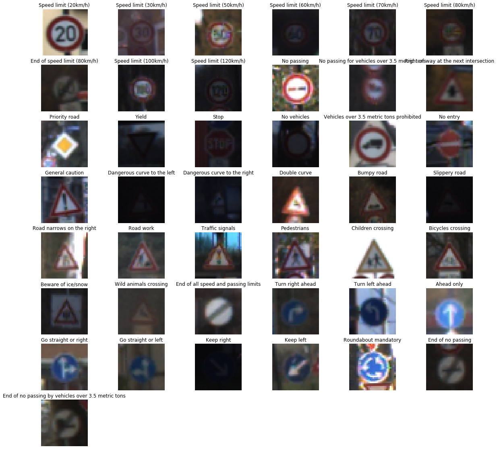
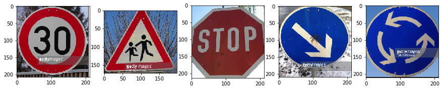

## Project: Build a Traffic Sign Recognition Program
[](http://www.udacity.com/drive)

Overview
---
Convolutional neural networks is implemented to classify German Traffic Sign Dataset](http://benchmark.ini.rub.de/?section=gtsrb&subsection=dataset). The trained network is further tested upon the random German Traffic Signs picked from the internet.

Project steps included:
* Load the [German Traffic Sign Dataset](http://benchmark.ini.rub.de/?section=gtsrb&subsection=dataset)
* Explore, summarize and visualize the data set
* Design, train and test a model architecture
* Use the model to make predictions on new images
* Analyze the softmax probabilities of the new images
* Summarize the results with a written report (this README file)

Dependencies
---
The lab environment can be created with CarND Term1 Starter Kit. Click [here](https://github.com/udacity/CarND-Term1-Starter-Kit/blob/master/README.md) for the details.

This lab requires:

* [CarND Term1 Starter Kit](https://github.com/udacity/CarND-Term1-Starter-Kit)
* Anaconda
* TensorFlow 2
  ```
  conda env create -f tf2_gpu.yml
  ```

Dataset
---
German Traffic Sign Dataset](http://benchmark.ini.rub.de/?section=gtsrb&subsection=dataset) is used for the training, validation and testing of the neural network.

The Dataset consists of 34799 training images, 12630 testing images and 4410 validation images.
Each image is of 32 x 32 x 3 shape.
Whole dataset can be catogrized in 43 classes.


 The undermentioned image shows the visualization of the Dataset

<p align="center">

</p>

Design and Test a Model Architecture
---

#### Preprocessing

Once the dataset images are loaded, all the pixel value of the images is normalized  to be between 0 and 1.

#### Model Architecture

The neural network is inspired by the LeNet Neural Network.

First Layer:

The input for the neural network is a 32×32x3 image which passes through the first convolutional layer with 18 feature maps or filters having size 5×5 and a stride of one. The image dimensions changes from 32x32x1 to 28x28x18.

Second Layer:

Then the network applies average pooling layer or sub-sampling layer with a filter size 2×2 and a stride of two. The resulting image dimensions will be reduced to 14x14x18.

Third Layer:

Next, there is a second convolutional layer with 48 feature maps having size 5×5 and a stride of 1.The image dimensions changes from 14x14x6 to 10x10x48.

Fourth Layer:

The fourth layer is again an average pooling layer with filter size 2×2 and a stride of 2. This layer is the same as the second layer except it has 48 feature maps so the output will be reduced to 5x5x48.

Fifth Layer:

The fifth layer (C5) is a fully connected convolutional layer with 500 feature maps each of size 1×1. Each of the 500 units in C5 is connected to all the 1200 nodes (5x5x48) in the fourth layer S4.

Sixth Layer:

The sixth layer is a fully connected layer (F6) with 300 units.

Seventh Layer:

The seventh layer is a fully connected layer (F6) with 150 units.

Output Layer:

Finally, there is a fully connected softmax output layer ŷ with 43 possible values corresponding to the digits from 0 to 42.

#### Model Training

#### Solution Approach


Test a Model on New Images
---

#### Acquiring New Images

<p align="center">

</p>

#### Performance on New Images


#### Model Certainty - Softmax Probabilities
