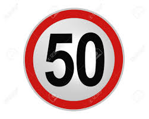

## Project: Build a Traffic Sign Recognition Program
[](http://www.udacity.com/drive)

Overview
---
Convolutional neural networks is implemented to classify German Traffic Sign Dataset](http://benchmark.ini.rub.de/?section=gtsrb&subsection=dataset). The trained network is further tested upon the random German Traffic Signs picked from the internet.

Project steps included:
* Load the [German Traffic Sign Dataset](http://benchmark.ini.rub.de/?section=gtsrb&subsection=dataset)
* Explore, summarize and visualize the data set
* Design, train and test a model architecture
* Use the model to make predictions on new images
* Analyze the softmax probabilities of the new images
* Summarize the results with a written report (this README file)

Dependencies
---
The lab environment can be created with CarND Term1 Starter Kit. Click [here](https://github.com/udacity/CarND-Term1-Starter-Kit/blob/master/README.md) for the details.

This lab requires:

* [CarND Term1 Starter Kit](https://github.com/udacity/CarND-Term1-Starter-Kit)
* Anaconda
* TensorFlow 2
  ```
  conda env create -f environment.yml
  ```

Dataset
---
German Traffic Sign Dataset](http://benchmark.ini.rub.de/?section=gtsrb&subsection=dataset) is used for the training, validation and testing of the neural network.

The Dataset consists of 34799 training images, 12630 testing images and 4410 validation images.
Each image is of 32 x 32 x 3 shape.
Whole dataset can be catogrized in 43 classes.


 The undermentioned image shows the visualization of the Dataset

<p align="center">

</p>

Design and Test a Model Architecture
---

#### Preprocessing

Once the dataset images are loaded, the images are convertes to grayscale and then brightness of the graysacle is adjusted using ```cv2.equalizeHist```. Then, all the pixel value of the images is normalized  to be between 0 and 1.

#### Model Architecture

The neural network is inspired by the LeNet Neural Network.

First Layer:

The input for the neural network is a 32×32x1 image which passes through the first convolutional layer with 12 feature maps or filters having size 5×5 and a stride of one. The image dimensions changes from 32x32x1 to 28x28x12.

Second Layer:

Then the network applies average pooling layer or sub-sampling layer with a filter size 2×2 and a stride of two. The resulting image dimensions will be reduced to 14x14x12.

Third Layer:

Next, there is a second convolutional layer with 30 feature maps having size 5×5 and a stride of 1.The image dimensions changes from 14x14x6 to 10x10x30.

Fourth Layer:

The fourth layer is again an average pooling layer with filter size 2×2 and a stride of 2. This layer is the same as the second layer except it has 30 feature maps so the output will be reduced to 5x5x30.

Fifth Layer:

The sixth layer is a fully connected layer (F5) with 200 units.

Sixth Layer:

The sixth layer is a fully connected layer (F6) with 120 units.

Output Layer:

Finally, there is a fully connected softmax output layer ŷ with 43 possible values corresponding to the digits from 0 to 42.

#### Model Training
The model is compiled with sparse categorical cross-entropy loss, and optimized using Adadelta

#### Solution Approach

The accuracy for the training, validation and the test data is 97.76 %, 96.03 % and 93.65 % respectively

Test a Model on New Images
---

#### Acquiring New Images

Five new germen traffic signs were acquired from the internet.
<p align="center">



</p>

#### Performance on New Images
The new acquired images are resized to 32 x 32 x 3 size and then pre-processed as the training, validation and test data were pre-processed.

The accuracy of the network for the given images is observed to 100 %

#### Model Certainty - Softmax Probabilities


| Tables |Class Code |Top 5 classes prediction| Respective Probability  |
| ------------------- | :----------------:|:-------------:| :-----:|
| Speed	limit	(50km/h)|   2  |  2, 1, 5, 3, 38 | 65.6%, 19.0%, 37.3%, 33.1%, 12.2% |
| Keep right   | 38| 38 ,34, 13, 1, 2  |   100 %, 0 %, 0 %, 0 %, 0 %  |
| Yield | 13| 13, 35, 15, 12, 34     | 100 %, 0 %, 0 %, 0 %, 0 %|
| General Caution | 18| 18, 26, 27, 11, 24     |   100 %, 0 %, 0 %, 0 %, 0 % |
| Stop |14 | 14, 13, 25, 22, 33 |  24.9%, 24.6%, 8.6%, 7.9%, 4.8% |
